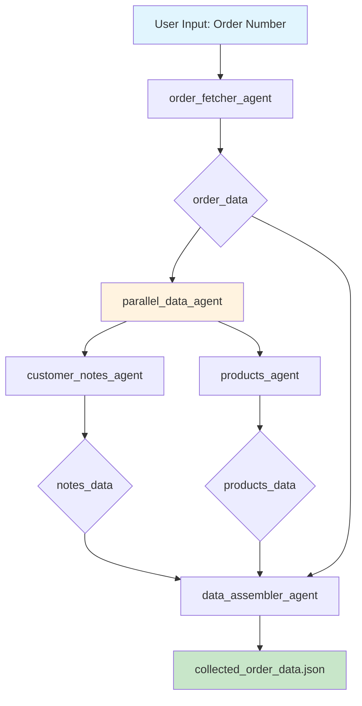

# Exercise 1: Data Collection Pipeline

## Pipeline Architecture



## Agent Flow Details

### 1. **order_fetcher_agent**
- **Input**: Order number from user
- **Tool**: `execute_query` (BigQuery)
- **Query**: Fetches from `delivery_orders` table
- **Output**: `order_data`

### 2. **parallel_data_agent** (Orchestrator)
Runs two agents simultaneously:

#### 2a. **customer_notes_agent**
- **Input**: `order_data` (uses DATA_ID)
- **Tool**: `execute_query` (BigQuery)
- **Query**: Fetches from `delivery_notes` table
- **Output**: `notes_data`

#### 2b. **products_agent**
- **Input**: `order_data` (uses DATA_ID)
- **Tool**: `execute_query` (BigQuery)
- **Query**: Fetches from `delivery_products` table
- **Output**: `products_data`

### 3. **data_assembler_agent**
- **Input**: All previous outputs (`order_data`, `notes_data`, `products_data`)
- **Tool**: None (pure data transformation)
- **Output**: Structured JSON combining all data

## Data Flow

```
Order Number (e.g., "CG92094171")
    ↓
BigQuery: delivery_orders
    ↓
order_data (includes DATA_ID)
    ↓
    ├─→ BigQuery: delivery_notes → notes_data
    └─→ BigQuery: delivery_products → products_data
    ↓
Combined structured JSON
    ↓
collected_order_data.json
```

## Key Features

- **Parallel Execution**: Customer notes and products fetched simultaneously
- **Data Passing**: Uses `output_key` to pass data between agents
- **Error Handling**: Each agent handles query failures gracefully
- **Scalability**: Can process any order number in the dataset