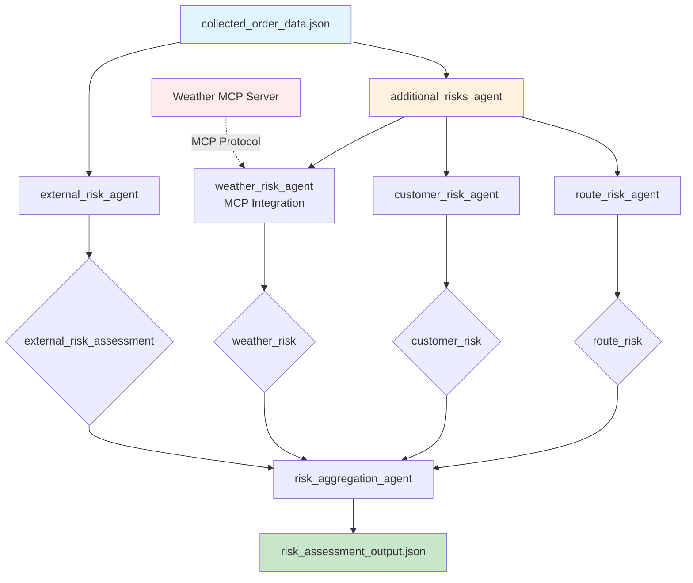

# Exercise 2: Risk Assessment Pipeline

## Pipeline Architecture



## Agent Flow Details

### 1. **external_risk_agent**
- **Input**: Complete order data
- **Tool**: `call_external_risk_model`
- **Purpose**: Integrate with proprietary risk models
- **Output**: `external_risk_assessment`
  - overall_risk_score (1-10)
  - risk_level (HIGH/MEDIUM/LOW)
  - risk_percentile
  - top_risk_factors

### 2. **additional_risks_agent** (Parallel Orchestrator)
Runs three specialized risk assessments simultaneously:

#### 2a. **weather_risk_agent** (MCP Integration)
- **Input**: Order data (extracts date and location)
- **Tool**: `MCPToolset` → `assess_weather_risk`
- **External Service**: Weather MCP Server
- **Output**: `weather_risk`
  - weather_risk_score
  - weather_factors
  - weather_data

#### 2b. **customer_risk_agent**
- **Input**: Customer data from order
- **Tool**: `assess_customer_risk`
- **Factors**: PRO status, address type, special instructions
- **Output**: `customer_risk`
  - customer_risk_score
  - customer_factors

#### 2c. **route_risk_agent**
- **Input**: Order and environmental data
- **Tool**: `assess_route_risk`
- **Factors**: Vehicle type, weight, street access
- **Output**: `route_risk`
  - route_risk_score
  - route_factors
  - access_notes

### 3. **risk_aggregation_agent**
- **Input**: All risk assessments
- **Tool**: None (aggregation logic)
- **Output**: Comprehensive risk assessment with recommendations

## MCP Integration Details

```
weather_risk_agent
    ↓
MCPToolset Configuration:
- Command: python weather_mcp_server.py
- Protocol: stdio
- Tool Filter: ['assess_weather_risk']
    ↓
Weather MCP Server:
- Input: {city, date}
- Processing: Weather data lookup + risk calculation
- Output: {weather_risk_score, factors, weather_data}
```

## Risk Scoring System

| Risk Category | Score Range | Factors |
|--------------|-------------|----------|
| External Model | 1-10 | Historical data, ML predictions |
| Weather | 1-10 | Precipitation, conditions, temperature |
| Customer | 1-10 | PRO status, address type, notes |
| Route | 1-10 | Vehicle match, access, weight |

## Output Structure

```json
{
  "risk_assessment": {
    "overall_risk_score": 6,
    "risk_level": "MEDIUM",
    "risk_percentile": 65,
    "risk_scores": {
      "overall": 6,
      "weather": 2,
      "customer": 5,
      "route": 7
    },
    "risk_factors": [...],
    "recommendations": [...]
  }
}
```

## Key Features

- **External Model Integration**: Easy to swap with proprietary models
- **MCP Protocol**: Standardized external service integration
- **Parallel Processing**: Multiple risk factors assessed simultaneously
- **Actionable Insights**: Specific recommendations based on risks