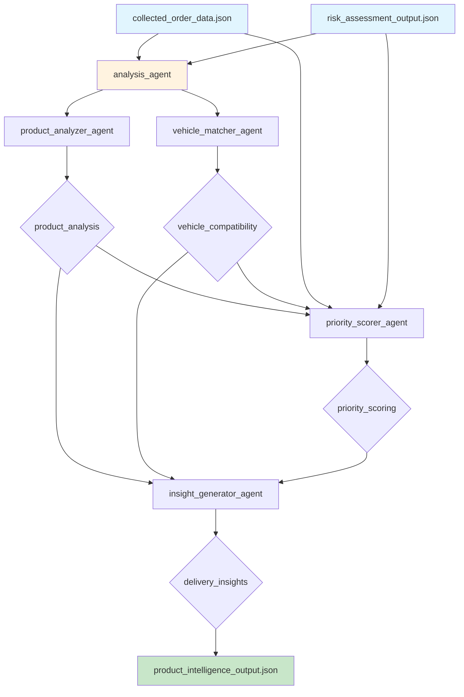

# Exercise 3: Product Intelligence Pipeline

## Pipeline Architecture



## Agent Flow Details

### 1. **analysis_agent** (Parallel Orchestrator)
Runs two analysis agents simultaneously:

#### 1a. **product_analyzer_agent**
- **Input**: Product list from order data
- **Tool**: `analyze_product_characteristics`
- **Analysis**:
  - Weather sensitivity detection
  - Handling requirements
  - Product categorization
  - Bulk item identification
- **Output**: `product_analysis`

#### 1b. **vehicle_matcher_agent**
- **Input**: Order and customer data
- **Tool**: `check_vehicle_compatibility`
- **Checks**:
  - Weight vs vehicle capacity
  - Volume vs vehicle limits
  - Pallet count vs capacity
  - Destination accessibility
- **Output**: `vehicle_compatibility`

### 2. **priority_scorer_agent**
- **Input**: 
  - Original order data
  - Risk assessment
  - Product analysis
  - Vehicle compatibility
- **Tool**: `calculate_priority_score`
- **Scoring Components**:
  - Order value (up to 30 points)
  - Risk level (10-30 points)
  - PRO customer bonus (+15)
  - Special instructions (+10)
  - Weather sensitivity (+10)
  - Vehicle issues (+5)
- **Output**: `priority_scoring` (0-100 scale)

### 3. **insight_generator_agent**
- **Input**: All previous analyses
- **Tool**: None (LLM reasoning)
- **Generates**:
  - Product insights summary
  - Delivery complexity assessment
  - Key challenges list
  - Success factors
  - Equipment requirements
- **Output**: `delivery_insights`

## Data Dependencies

```
Exercise 1 Output          Exercise 2 Output
       ↓                          ↓
collected_order_data.json  risk_assessment_output.json
       ↓                          ↓
       └──────────┬───────────────┘
                  ↓
          Product Intelligence
                  ↓
     product_intelligence_output.json
```

## Priority Scoring Algorithm

```python
Score Calculation:
├── Base Components (0-60)
│   ├── Order Value: min(30, order_value/100)
│   └── Risk Level: HIGH=30, MEDIUM=20, LOW=10
│
└── Bonus Factors (0-40)
    ├── PRO Customer: +15
    ├── Special Instructions: +10
    ├── Weather Sensitive: +10
    └── Vehicle Issues: +5

Final Score = min(100, sum(all_components))
```

## Intelligence Categories

### Product Analysis
| Category | Detection Method | Impact |
|----------|-----------------|---------|
| Weather Sensitive | Keywords: drywall, cement, lumber | Requires protection |
| Heavy Items | Keywords: lumber, timber | Special equipment needed |
| Fragile | Keywords: glass, fragile | Careful handling |

### Vehicle Compatibility Matrix
| Vehicle | Max Weight | Max Volume | Max Pallets | Suitable For |
|---------|------------|------------|-------------|--------------|
| FLAT | 5000 lbs | 500 cu ft | 8 | Residential, Commercial |
| BOX | 3000 lbs | 300 cu ft | 6 | Residential, Commercial |
| SMALL | 1500 lbs | 150 cu ft | 2 | Residential only |

## Output Structure

```json
{
  "product_analysis": {
    "weather_sensitive": true,
    "weather_concerns": ["lumber - protect from rain"],
    "handling_requirements": ["Heavy lifting equipment"],
    "product_categories": ["Lumber"]
  },
  "vehicle_compatibility": {
    "vehicle_appropriate": true,
    "issues": [],
    "recommendations": []
  },
  "priority_scoring": {
    "priority_score": 67,
    "priority_level": "MEDIUM",
    "score_breakdown": {...}
  },
  "delivery_insights": {
    "intelligent_insights": {
      "product_insights": "...",
      "delivery_complexity": "...",
      "key_challenges": [...],
      "success_factors": [...],
      "equipment_needed": [...]
    }
  }
}
```

## Key Features

- **Intelligent Product Analysis**: Understands product characteristics
- **Vehicle-Destination Matching**: Ensures appropriate vehicle selection
- **Transparent Scoring**: Clear breakdown of priority calculation
- **Actionable Insights**: Specific guidance for successful delivery