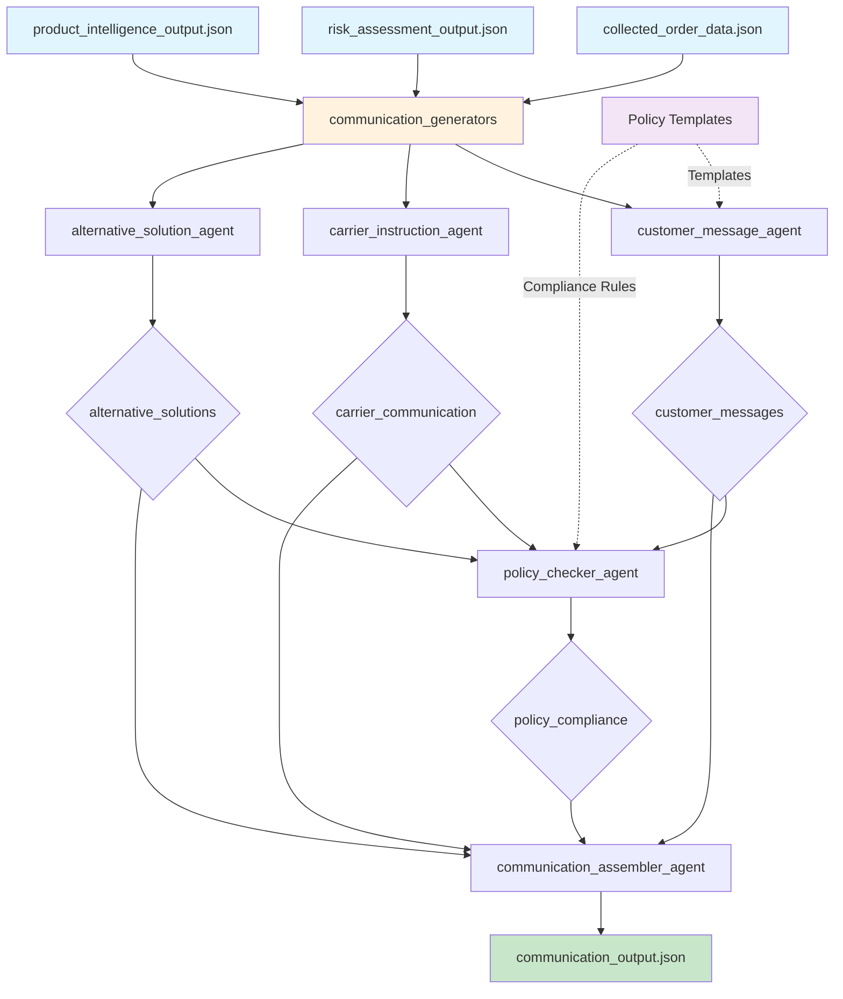

# Exercise 4: Communication Generation Pipeline

## Pipeline Architecture



## Agent Flow Details

### 1. **communication_generators** (Parallel Orchestrator)
Runs three communication agents simultaneously:

#### 1a. **customer_message_agent**
- **Input**: Order, risk, and product data
- **Tool**: `format_customer_message`
- **Templates Used**:
  - `standard_confirmation`
  - `pro_notification`
  - `weather_contingency`
  - `access_confirmation`
- **Logic**:
  - HIGH risk → weather/access templates
  - PRO customer → pro_notification template
  - Standard → standard_confirmation
- **Output**: `customer_messages`

#### 1b. **carrier_instruction_agent**
- **Input**: Order and risk data
- **Tools**: 
  - `generate_carrier_instructions`
  - `format_customer_message` (carrier_alert template)
- **Generates**:
  - Equipment requirements
  - Access notes
  - Risk mitigation steps
  - Contact protocols
- **Output**: `carrier_communication`

#### 1c. **alternative_solution_agent**
- **Input**: Order and risk assessments
- **Tools**:
  - `suggest_alternatives`
  - `generate_alternative_dates`
- **Alternative Types**:
  - Reschedule options
  - Split delivery
  - Hold for pickup
- **Output**: `alternative_solutions`

### 2. **policy_checker_agent**
- **Input**: All generated messages
- **Tool**: `check_policy_compliance`
- **Checks**:
  - Required elements (order #, dates)
  - Prohibited terms
  - Message length (SMS limits)
  - Support contact inclusion
- **Output**: `policy_compliance`

### 3. **communication_assembler_agent**
- **Input**: All communications and compliance checks
- **Tool**: None (assembly logic)
- **Creates**:
  - Final structured output
  - Action summaries
  - Contingency plans
- **Output**: Complete communication package

## Communication Templates

### Customer Templates
| Template | Use Case | Max Length |
|----------|----------|------------|
| standard_confirmation | Normal deliveries | 160 chars |
| pro_notification | PRO customers | 160 chars |
| weather_contingency | Weather risks | 160 chars |
| access_confirmation | Access issues | 160 chars |

### Message Timing
| Type | When to Send | Priority |
|------|--------------|----------|
| Primary | Immediate | HIGH |
| Confirmation | 1 day before | MEDIUM |
| Reminder | Morning of delivery | LOW |

## Policy Compliance Rules

```python
Compliance Checks:
├── Required Elements
│   ├── Order number with #
│   ├── Delivery date
│   ├── Clear next steps
│   └── Support contact
│
├── Prohibited Terms
│   ├── Driver names
│   ├── Guarantees/promises
│   └── Competitor references
│
└── Format Requirements
    ├── SMS: ≤ 160 characters
    └── No special characters
```

## Alternative Solution Matrix

| Risk Level | Primary Alternative | Secondary Alternative |
|------------|-------------------|---------------------|
| HIGH | Reschedule to clear day | Hold for pickup |
| MEDIUM | Provide weather protection | Split delivery |
| LOW | Standard delivery | Early time slot |

## Output Structure

```json
{
  "communications": {
    "order_number": "CG92094171",
    "risk_level": "MEDIUM",
    "customer_messages": [
      {
        "type": "primary",
        "template_used": "weather_contingency",
        "message": "...",
        "send_timing": "immediate"
      }
    ],
    "carrier_instructions": {
      "alert_message": "...",
      "detailed_instructions": {
        "priority": "HIGH",
        "equipment_needed": [...],
        "access_notes": [...],
        "contact_protocol": [...]
      }
    },
    "alternatives": [...],
    "action_summary": {
      "immediate_actions": [...],
      "scheduled_actions": [...],
      "contingency_plans": [...]
    }
  }
}
```

## Business Value

### Time Savings
- **Before**: 5-10 minutes per message
- **After**: < 10 seconds
- **Accuracy**: 100% policy compliance

### Key Features
- **Policy-Driven**: All messages comply automatically
- **Context-Aware**: Different messages for different scenarios
- **Ready-to-Send**: No editing required
- **Alternative Solutions**: Pre-approved options included