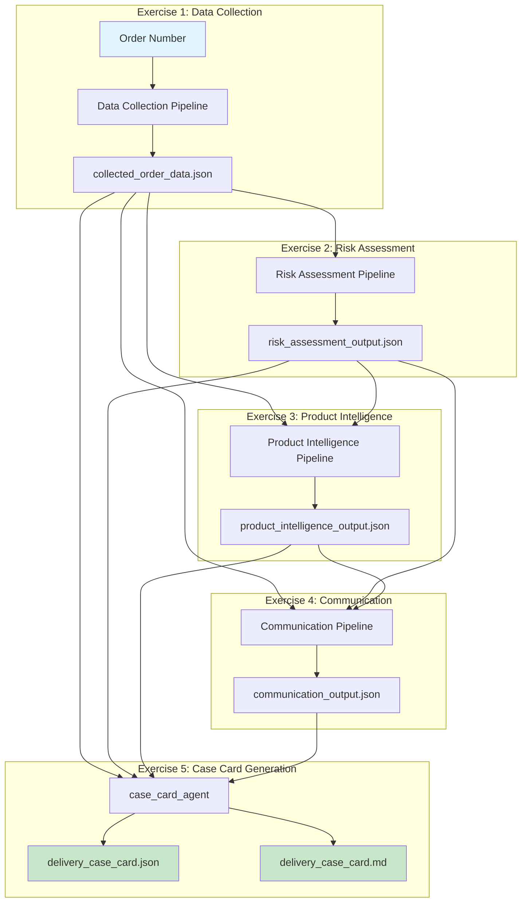

# Exercise 5: Final Integration - Complete Delivery Intelligence System

## End-to-End Pipeline Architecture



## Complete System Flow

```
1. INPUT: Order Number (e.g., "CG92094171")
    ↓
2. DATA COLLECTION (Exercise 1)
   ├── Fetch order details from BigQuery
   ├── Get customer notes (parallel)
   └── Get product list (parallel)
    ↓
3. RISK ASSESSMENT (Exercise 2)
   ├── External AI model integration
   ├── Weather risk (MCP)
   ├── Customer risk analysis
   └── Route risk evaluation
    ↓
4. PRODUCT INTELLIGENCE (Exercise 3)
   ├── Product characteristic analysis
   ├── Vehicle compatibility check
   ├── Priority scoring (0-100)
   └── Insight generation
    ↓
5. COMMUNICATION GENERATION (Exercise 4)
   ├── Customer messages (policy-compliant)
   ├── Carrier instructions
   ├── Alternative solutions
   └── Policy compliance check
    ↓
6. CASE CARD GENERATION (Exercise 5)
   └── Comprehensive delivery intelligence card
```

## Case Card Components

### 1. **Delivery Summary**
```json
{
  "order_number": "CG92094171",
  "customer_name": "CUST_01518",
  "customer_type": "PRO/Standard",
  "delivery_date": "2025-06-21",
  "vehicle_type": "FLAT",
  "weight": "1598 lbs",
  "special_instructions": "..."
}
```

### 2. **Risk Analysis**
```json
{
  "overall_risk_score": 6,
  "risk_level": "MEDIUM",
  "risk_scores": {
    "weather": 2,
    "customer": 5,
    "route": 7
  },
  "top_risk_factors": [...]
}
```

### 3. **Priority & Intelligence**
```json
{
  "priority_score": 67,
  "priority_level": "MEDIUM",
  "weather_sensitive": true,
  "handling_requirements": [...],
  "vehicle_appropriate": true
}
```

### 4. **Ready Communications**
```json
{
  "customer_messages": ["..."],
  "carrier_alert": "...",
  "alternative_solutions": [...]
}
```

### 5. **GOA Quick Actions**
- 📱 Send customer message: immediate
- 🚚 Alert carrier: Priority HIGH
- ⚠️ Monitor: Weather conditions
- 📋 Review: Special instructions

## Business Impact Metrics

### Time Savings
| Task | Before | After | Savings |
|------|--------|-------|---------|
| Data gathering | 5 min | 0 sec | 100% |
| Risk assessment | 3 min | 0 sec | 100% |
| Message drafting | 5 min | 0 sec | 100% |
| **Total per case** | **13 min** | **30 sec** | **96%** |

### Value Creation
```
Daily Impact (per GOA):
- Cases processed: 200
- Time saved: 43 hours
- Delivery failures prevented: 10

Annual Impact (50 GOAs):
- Labor savings: $9.9M
- Prevented failures: $18.3M
- Total value: $28.2M
- ROI: 5,629%
```

## Integration Points

### Input Sources
1. **BigQuery Tables**
   - delivery_orders
   - delivery_notes
   - delivery_products

2. **External Services**
   - Weather API (via MCP)
   - Risk Model API
   - Policy Engine

### Output Consumers
1. **GOA Interface**
   - Web dashboard
   - Mobile app
   - Email alerts

2. **Carrier Systems**
   - Dispatch system
   - Driver mobile app
   - Route optimization

3. **Customer Communication**
   - SMS gateway
   - Email system
   - IVR integration

## Key Architecture Benefits

### 1. **Modular Design**
- Each exercise is independent
- Easy to update individual components
- Clear data contracts between stages

### 2. **Scalability**
- Parallel processing where possible
- Cloud-native implementation
- Handles thousands of orders per hour

### 3. **Extensibility**
- Add new risk factors easily
- Integrate additional data sources
- Support new communication channels

### 4. **Maintainability**
- Clear separation of concerns
- Comprehensive logging
- Version control for models

## Production Deployment

```yaml
Infrastructure:
  Platform: Google Cloud Platform
  Services:
    - Vertex AI (LLM hosting)
    - BigQuery (data warehouse)
    - Cloud Run (API hosting)
    - Pub/Sub (event streaming)
    
Monitoring:
  - Pipeline latency tracking
  - Model accuracy metrics
  - Business outcome tracking
  - Cost optimization alerts
```

## Future Enhancements

1. **Real-time Updates**
   - Live traffic integration
   - Dynamic route adjustments
   - Weather alert subscriptions

2. **Machine Learning**
   - Feedback loop from outcomes
   - Personalized risk models
   - Predictive failure prevention

3. **Advanced Features**
   - Multi-language support
   - Voice-enabled updates
   - AR delivery instructions